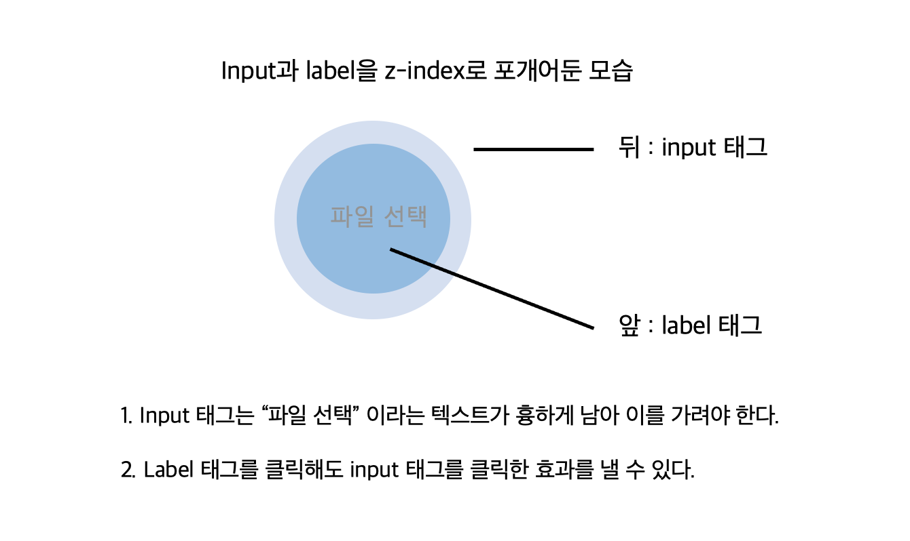

### 🚨 주의! 본 포스팅은 리액트 웹 어플리케이션을 기반으로 합니다.

클라이언트는 유저 페이지에서 프로필 사진을 지정할 수 있도록 하고, 이미지를 업로드하면 곧장 S3에 올라갈 수 있도록 합니다.  
이를 위해 [input 태그 커스텀] - [AWS SDK 연동] - [대체 이미지 설정] 단계를 소개합니다.

## [1 / 3] - input 태그 커스텀


먼저 클라이언트의 파일 업로드를 위해 `input[type=file]` 태그를 활용합니다.

```html
<input type="file" />
```

그런데, 이걸 스타일하는게 아주 악랄합니다.


`input[type=file]`는 브라우저가 기본적으로 "파일 선택 / 선택된 파일 없음" 이라는 문구를 출력하는데요, 이게 속성을 설정한다고 해서 보이지 않는게 아니라 `position: absolute` 등 트릭을 활용해서 보이지 않게 해야만 합니다.

###

제가 사용한 방법과 팁을 공유드리자면, input 태그는 label을 클릭하는 것으로도 클릭 이벤트를 발생시킬 수 있습니다.  
그래서 input 태그를 뒤에 두고, label 태그를 앞에 배치해 "파일 선택" 이라는 텍스트를 가리기로 했습니다.



```jsx
<input type="file" id="upload" className="image-upload" />
<label htmlFor="upload" className="image-upload-wrapper"></label>
```

```css
/* 실제 파일 업로드를 수행하는 버튼입니다. */
.image-upload {
  width: 120px !important;
  height: 120px !important;
  font-size: 100px;
  text-align: right;
  min-width: 0 !important;
  outline: none;
  background: rgb(0, 0, 0);
  cursor: inherit;
  display: block !important;
  border-radius: 50% !important;
  cursor: pointer;
  position: absolute;
  margin: 0 !important;
  z-index: -1;
}

.image-upload-wrapper {
  position: inherit;
  width: 120px !important;
  height: 120px !important;
  font-size: 100px;
  text-align: right;
  min-width: 0 !important;
  outline: none;
  background: rgb(255, 255, 255);
  cursor: inherit;
  display: block !important;
  border-radius: 50% !important;
  cursor: pointer;
}
```

이제 해당 프로필 영역을 클릭하면 이미지를 선택할 수 있습니다.  
`input[type=file]`에서 다루는 파일 객체는 이벤트 객체의 `e.target.files[0]` 에 저장되어 있습니다.

## [2 / 3] - AWS SDK 연동하기

AWS 객체를 사용하기 위해 프로젝트 폴더에 aws-sdk 모듈을 설치합니다.

```
npm i aws-sdk
```

sdk 설치가 끝났다면 AWS 설정 객체를 업데이트합니다.  
이 때, IdentityPoolId는 [이전 글](https://c17an.netlify.app/blog/aws/aws-s3%EB%A1%9C-%EC%9D%B4%EB%AF%B8%EC%A7%80-%EC%84%9C%EB%B2%84-%EB%A7%8C%EB%93%A4%EA%B8%B0-1%ED%8E%B8/article/)의 두 번째 단계를 참고하시면 됩니다.

```jsx
import AWS from "aws-sdk"

const User = props => {
  AWS.config.update({
    region: bucketRegion, // 버킷이 존재하는 리전을 문자열로 입력합니다. (Ex. "ap-northeast-2")
    credentials: new AWS.CognitoIdentityCredentials({
      IdentityPoolId: IdentityPoolId, // cognito 인증 풀에서 받아온 키를 문자열로 입력합니다. (Ex. "ap-northeast-2...")
    }),
  })

  return (
    <>
      <input type="file" id="upload" className="image-upload" />
      <label htmlFor="upload" className="image-upload-wrapper"></label>
    </>
  )
}
```

[이전 글](https://c17an.netlify.app/blog/aws/aws-s3%EB%A1%9C-%EC%9D%B4%EB%AF%B8%EC%A7%80-%EC%84%9C%EB%B2%84-%EB%A7%8C%EB%93%A4%EA%B8%B0-1%ED%8E%B8/article/)의 AWS 환경을 잘 따라왔다면, S3에 접근할 수 있는 상태가 되었습니다.

###

이제 파일을 선택하면 S3에 업로드할 수 있도록 `input[type=file]`의 콜백 함수를 작성하겠습니다.

```js
const handleFileInput = e => {
  // input 태그를 통해 선택한 파일 객체
  const file = e.target.files[0]

  // S3 SDK에 내장된 업로드 함수
  const upload = new AWS.S3.ManagedUpload({
    params: {
      Bucket: [S3 버킷명], // 업로드할 대상 버킷명
      Key: [파일명] + ".jpg", // 업로드할 파일명 (* 확장자를 추가해야 합니다!)
      Body: file, // 업로드할 파일 객체
    },
  })

  const promise = upload.promise()

  promise.then(
    function (data) {
      alert("이미지 업로드에 성공했습니다.")
    },
    function (err) {
      return alert("오류가 발생했습니다: ", err.message)
    }
  )
}
```

한번 코드를 합쳐 보겠습니다.

```jsx
import AWS from "aws-sdk"

const User = props => {
  AWS.config.update({
    region: bucketRegion,
    credentials: new AWS.CognitoIdentityCredentials({
      IdentityPoolId: IdentityPoolId
    }),
  })

  const handleFileInput = e => {
  const file = e.target.files[0]

  const upload = new AWS.S3.ManagedUpload({
    params: {
      Bucket: [S3 버킷명],
      Key: [파일명] + ".jpg",
      Body: file,
    },
  })

  const promise = upload.promise()

  promise.then(
    function (data) {
      alert("이미지 업로드에 성공했습니다.")
    },
    function (err) {
      return alert("오류가 발생했습니다: ", err.message)
    }
  )
}

  return (
    <>
      <input type="file" id="upload" className="image-upload" onChange = {handleFileInput} />
      <label htmlFor="upload" className="image-upload-wrapper"></label>
    </>
  )
}
```

이제 파일을 선택하면 버킷에 이미지가 추가된 것을 확인할 수 있습니다.


## [3 / 3] - 이미지 불러오기 & 대체 이미지 설정

이제 업로드한 이미지를 활용해 보겠습니다.  
이전 글에서 S3 버킷을 퍼블릭으로 설정하면 이미지를 외부에서 접근할 수 있다고 소개했습니다.


이를 이용해, `img[src=""]` 를 활용해 버킷의 이미지를 가져다가 쓰겠습니다.

```jsx
<input
  type="file"
  id="upload"
  className="image-upload"
  onChange="{handleFileInput}"
/>
<label htmlFor="upload" className="image-upload-wrapper">
  
</label>
```

```css
/* 이미지를 꾸미는 CSS */
.profile-img {
  position: inherit;
  width: 120px !important;
  height: 120px !important;
  font-size: 100px;
  min-width: 0 !important;
  outline: none;
  cursor: inherit;
  display: block !important;
  border-radius: 50% !important;
  cursor: pointer;
}
```

이제 업로드한 이미지를 가져다가 사용할 수 있습니다.


그러나, 만약 찾는 이미지가 없다면 이미지가 이렇게 깨지게 됩니다.


여기서는 onError 라는 프로퍼티를 활용합니다.  
useRef를 통해 이미지 DOM을 직접 지정한 뒤, 이미지를 버킷에서 불러오는데 실패하면 이미지의 소스를 대체 이미지로 변경하는 수법입니다.

```jsx
import { useRef } from "react"


const User = () => {
    const imgRef = useRef(null)
    // ... 생략
    return (
        
        onError={() => {
            return (imgRef.current.src =
            "https://대체 이미지 링크")
        }}
        />
    )
}
```

이렇게 함으로써 찾는 유저의 프로필이 없다면 대체 이미지를 보여줄 수 있었습니다.


💻 전체 코드는 아래와 같습니다.

```jsx
import {useRef} from "React"
import AWS from "aws-sdk"

const User = props => {

  const imgRef = useRef(null)
  // Cognito 연동으로 S3 접근 권한을 얻는 부분
  AWS.config.update({
    region: bucketRegion,
    credentials: new AWS.CognitoIdentityCredentials({
      IdentityPoolId: IdentityPoolId
    }),
  })

  const handleFileInput = e => {
    const file = e.target.files[0]

    // AWS sdk에 포함된 함수로 파일을 업로드하는 부분
    const upload = new AWS.S3.ManagedUpload({
        params: {
        Bucket: [S3 버킷명],
        Key: [파일명] + ".jpg",
        Body: file,
        },
    })

    const promise = upload.promise()

    promise.then(
        function (data) {
        alert("이미지 업로드에 성공했습니다.")
        },
        function (err) {
        return alert("오류가 발생했습니다: ", err.message)
        }
    )
}

  return (
    <>
      <input type="file" id="upload" className="image-upload" onChange = {handleFileInput} />
      <label htmlFor="upload" className="image-upload-wrapper">
         
        onError={() => {
            return (imgRef.current.src =
            "https://대체 이미지 링크")
        }}
        />
      </label>
    </>
  )
}
```
